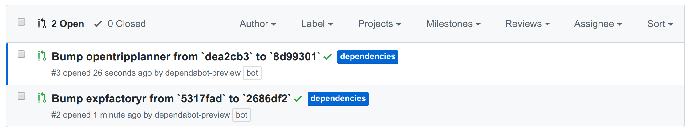
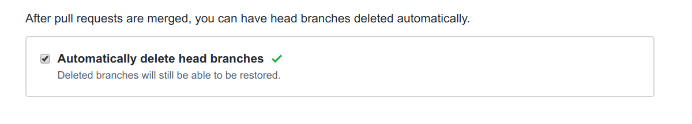

# vsoch r-universe

This is a development repository to figure out how to reproduce the functionality
of [r-universe/ropensci](https://github.com/r-universe/ropensci), but completely
using GitHub workflows.

## Plan of Action

The steps that I want to take are the following:

### 1. Submodule Updates

Currently, in the [r-universe/ropensci](https://github.com/r-universe/ropensci) repository,
it's required that a Jenkins server update submodules. However since dependabot was
acquired by GitHub and offers a [free service](https://dependabot.com/submodules/) to do this 
via pull request, I think we can try this out.

### 2. Pull Request

When a submodule is updated, this will trigger a pull request to the repository.
Normally this would need review by a person, however we would have a GitHub action
workflow to instead handle it.

### 3. GitHub Workflows

The pull request workflow would do some validation for the submodule, and then
do build staging. I will think more about this when I'm developing the workflows.
The builds should happen with GitHub actions, and deploy to the package server.


## Development

### 1. Dependabot 

I first connected dependabot by finding it on the [GitHub app](https://github.com/apps/dependabot-preview) page,
and generated the [.dependabot/config.yml](.dependabot/config.yml). It ran but errored without a submodule, so I
added several (here is an example of adding one) and you can see the complete set in the [git submodules file](.gitmodules):

```bash
git submodule add https://github.com/ropensci/DataSpaceR
```

I then waited until the next day, and along with adding a submodule that I can control ([expfactory-r](expfactory-r)),
I manually triggered dependabot to run. This is fantastic news, because what I learned is that
dependabot opens a separate pull request per package that is discovered to be updated (via the
submodule):



Which means we can move forward for the GitHub pull request workflow to handle each build
separately. I will work on this next. 

### 2. GitHub Pull Request Open Workflow

The goal will be to have each pull request action check that it's from dependabot, and
if so, merge the changes (updates to the submodule). This is [largely finished](.github/workflows/pull-request.yml)

A few comments for development:

 - I found a GitHub action to merge a pull request, which should be done after a successful build matrix.
 - It used to be the case that we would need to write or use an action to clean up merged branches, but this is now provided [natively](https://github.blog/changelog/2019-07-31-automatically-delete-head-branches-of-pull-requests/) via GitHub. So instead I enabled branch cleanup for the repository.



### 3. GitHub Pull Request Merge Workflow

When a pull request from dependabot to update a submodule is merged, this should
trigger a build matrix to generate packages across OS. This should follow suite
as is done in the example [staging](https://github.com/ropensci/staging) repository.

**under development**
